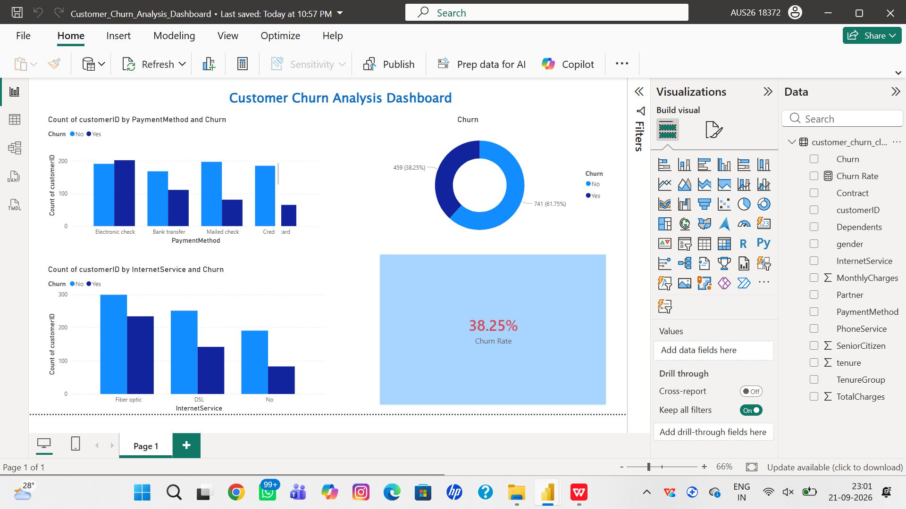

# Customer Churn Analysis Dashboard - 38.25% Churn Rate

## Overview
Analyzed 1200 telecom customers to find why they leave.

## Tools Used
- Python (Pandas, Colab)
- Power BI

## Key Insights
- **38.25%** Overall Churn
- Electronic Check payment = High Churn
- Fiber Optic Internet = High Churn

## Dashboard

## Links
- Colab Notebook: https://colab.research.google.com/drive/1lTuRYlIn0UyzNgxKJDnvQ3FOP-7OToSq?usp=sharing
- Power BI File: ./Customer_Churn_Analysis_Dashboard.pbix

## Author
PADALA MANI KEERTHI | Aspiring Data Analyst
